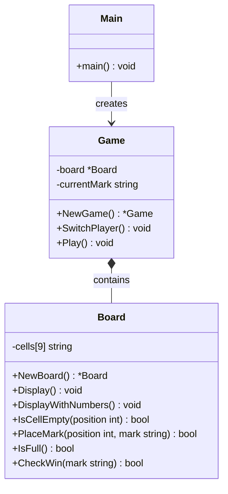

```mermaid
classDiagram
    class Board {
        -cells[9] string
        +NewBoard() *Board
        +Display() void
        +DisplayWithNumbers() void
        +IsCellEmpty(position int) bool
        +PlaceMark(position int, mark string) bool
        +IsFull() bool
        +CheckWin(mark string) bool
    }
    
    class Game {
        -board *Board
        -currentMark string
        +NewGame() *Game
        +SwitchPlayer() void
        +Play() void
    }
    
    class Main {
        +main() void
    }
    
    Game *-- Board : contains
    Main --> Game : creates
```
