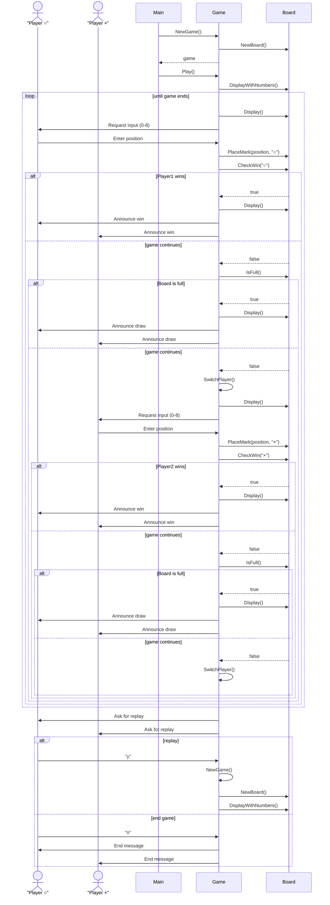

```mermaid
sequenceDiagram
    actor Player1 as "Player ○"
    actor Player2 as "Player ×"
    participant Main
    participant Game
    participant Board
    
    Main->>Game: NewGame()
    Game->>Board: NewBoard()
    Game-->>Main: game
    
    Main->>Game: Play()
    Game->>Board: DisplayWithNumbers()
    
    loop until game ends
        Game->>Board: Display()
        Game->>Player1: Request input (0-8)
        Player1->>Game: Enter position
        Game->>Board: PlaceMark(position, "○")
        
        Game->>Board: CheckWin("○")
        alt Player1 wins
            Board-->>Game: true
            Game->>Board: Display()
            Game->>Player1: Announce win
            Game->>Player2: Announce win
        else game continues
            Board-->>Game: false
            
            Game->>Board: IsFull()
            alt Board is full
                Board-->>Game: true
                Game->>Board: Display()
                Game->>Player1: Announce draw
                Game->>Player2: Announce draw
            else game continues
                Board-->>Game: false
                
                Game->>Game: SwitchPlayer()
                Game->>Board: Display()
                Game->>Player2: Request input (0-8)
                Player2->>Game: Enter position
                Game->>Board: PlaceMark(position, "×")
                
                Game->>Board: CheckWin("×")
                alt Player2 wins
                    Board-->>Game: true
                    Game->>Board: Display()
                    Game->>Player1: Announce win
                    Game->>Player2: Announce win
                else game continues
                    Board-->>Game: false
                    
                    Game->>Board: IsFull()
                    alt Board is full
                        Board-->>Game: true
                        Game->>Board: Display()
                        Game->>Player1: Announce draw
                        Game->>Player2: Announce draw
                    else game continues
                        Board-->>Game: false
                        Game->>Game: SwitchPlayer()
                    end
                end
            end
        end
    end
    
    Game->>Player1: Ask for replay
    Game->>Player2: Ask for replay
    alt replay
        Player1->>Game: "y"
        Game->>Game: NewGame()
        Game->>Board: NewBoard()
        Game->>Board: DisplayWithNumbers()
    else end game
        Player1->>Game: "n"
        Game->>Player1: End message
        Game->>Player2: End message
    end
```
