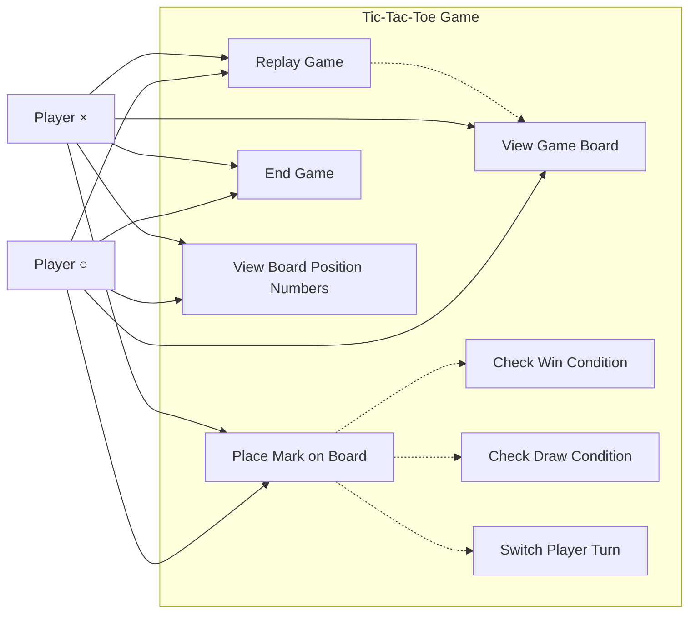

```mermaid
graph LR
    Player1["Player ○"]
    Player2["Player ×"]
    
    subgraph "Tic-Tac-Toe Game"
        UC1["View Game Board"]
        UC2["Place Mark on Board"]
        UC3["Check Win Condition"]
        UC4["Check Draw Condition"]
        UC5["Switch Player Turn"]
        UC6["Replay Game"]
        UC7["End Game"]
        UC8["View Board Position Numbers"]
    end
    
    Player1 --> UC1
    Player1 --> UC2
    Player1 --> UC6
    Player1 --> UC7
    Player1 --> UC8
    
    Player2 --> UC1
    Player2 --> UC2
    Player2 --> UC6
    Player2 --> UC7
    Player2 --> UC8
    
    UC2 -.-> UC3
    UC2 -.-> UC4
    UC2 -.-> UC5
    UC6 -.-> UC1
```
